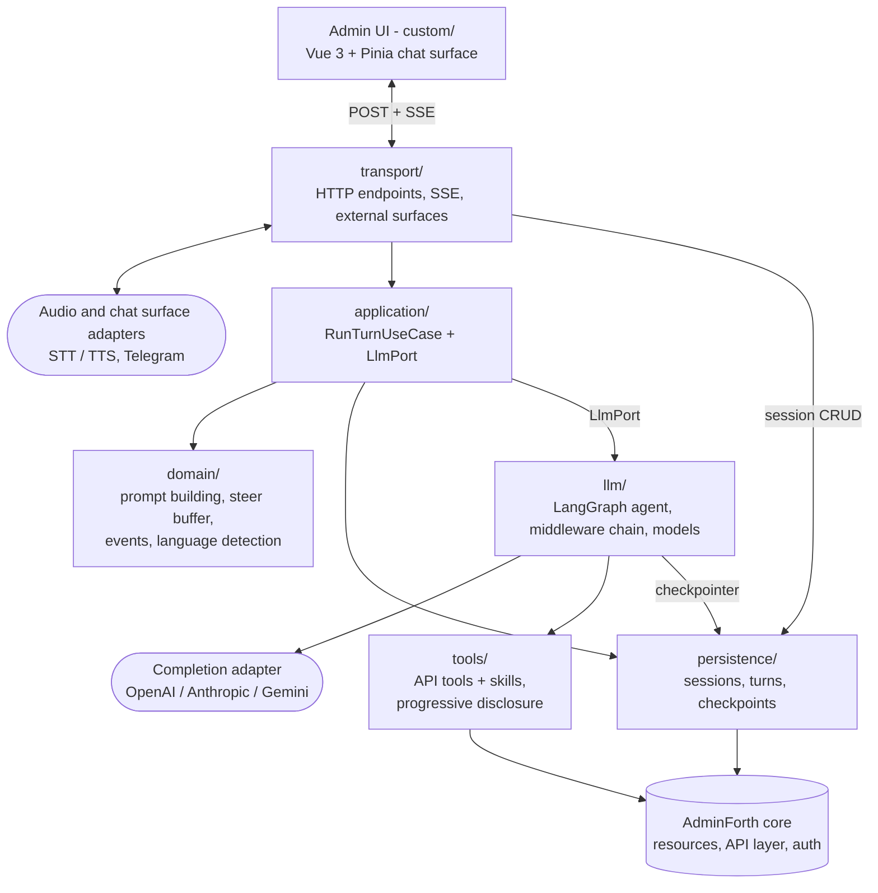
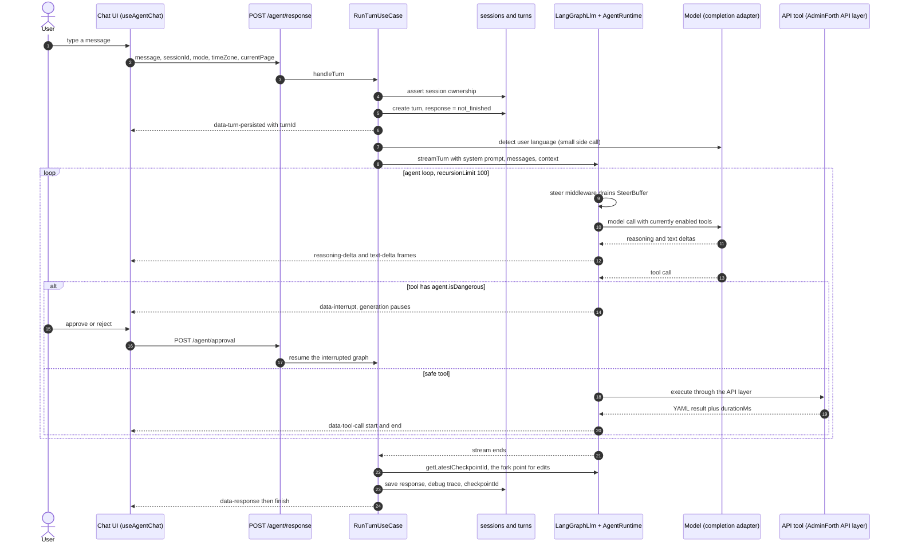
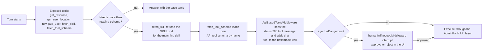

# AdminForth Agent Plugin

  <a href="https://www.npmjs.com/package/@adminforth/agent"></a> <a href="https://www.npmjs.com/package/@adminforth/agent"></a>

[](https://tluma.ai/ask-ai/devforth/adminforth)

Adds a native, tool-calling AI agent to your AdminForth application. The agent lives in a
chat panel inside the admin UI, can inspect and mutate your resources through safe
API-based tools, streams its answers token-by-token, and keeps persistent chat sessions.

> Full tutorial: [AdminForth Agent Documentation](https://adminforth.dev/docs/tutorial/Plugins/agent/)

## Features

- **Chat agent in the admin UI** — a streaming chat surface injected into every page.
- **Tool calling over your resources** — the agent reads and (optionally) mutates records
  through AdminForth's own API layer, so your access rules and validation still apply.
- **Progressive tool & skill disclosure** — the agent loads only the tools it needs, guided
  by Markdown *skills* you can extend.
- **Human-in-the-loop approvals** — tools you mark as dangerous pause for explicit
  approve/reject from the user before running.
- **Mid-turn steering** — send another instruction while the agent is still working; it is
  folded into the *running* turn before its next model call instead of waiting in line.
- **Message editing & branching** — edit an earlier message to fork the conversation from
  that turn's checkpoint: later turns are dropped and the answer is regenerated.
- **Multiple modes** — expose several models (e.g. *Fast*, *Balanced*, *Smart Thinking*)
  and let users switch between them.
- **Persistent sessions** — conversations are stored in your database; an optional
  checkpointer persists full LangGraph state across turns.
- **Voice in and out** — optional speech-to-text and text-to-speech via an audio adapter.
- **External chat surfaces** — optionally serve the same agent through webhooks (e.g.
  Telegram) with OAuth identity mapping.

Built on [LangChain / LangGraph](https://github.com/langchain-ai/langgraphjs).

## How it works

For each user message the plugin creates a *turn*, builds the system prompt (including the
list of your resources and available skills), streams the model's output back over SSE, and
persists the prompt/response to your turn resource. Tools are executed through AdminForth's
API endpoints; conversation memory is kept per session (`thread_id = sessionId`).

## Architecture

The plugin is layered so that the provider-specific parts (LangChain/LangGraph, the
completion adapter, the checkpointer) sit behind ports and never leak into the turn logic:

| Layer | Directory | Depends on |
| --- | --- | --- |
| Domain — prompt building, event vocabulary, buffers | [domain/](domain/) | adminforth types only |
| Application — the turn use case + ports | [application/](application/) | domain |
| LLM runtime — LangChain/LangGraph behind `LlmPort` | [llm/](llm/) | application, domain, tools |
| Tools & skills — API tools, progressive disclosure | [tools/](tools/) | AdminForth API layer |
| Persistence — sessions, turns, checkpoints | [persistence/](persistence/) | AdminForth resources |
| Transport — HTTP endpoints, SSE, external surfaces | [transport/](transport/) | application |
| Frontend — Vue 3 + Pinia chat surface | [custom/](custom/) | HTTP + SSE contract |



Every arrow into `AdminForth core` goes through its ordinary resource/API layer, so your
access rules, hooks and validation apply to the agent exactly as they do to a human admin.

### One turn, end to end



Two side channels run on top of that flow:

- **Steering** — `POST /agent/steer` buffers a message in the in-process `SteerBuffer`;
  the `beforeModel` steer middleware folds it in as a user message before the next model
  call and emits `data-steer-applied` on the turn's already-open stream.
- **Editing / branching** — `POST /agent/edit` forks from the previous turn's stored
  checkpoint id, truncates the later turns, and regenerates. Requires both
  `checkpointResource` and `turnResource.checkpointIdField`.

### Progressive tool & skill disclosure



## Requirements

- An AdminForth app (`adminforth >= 3.8.2`, declared as a peer dependency).
- A **completion adapter** that supports agent/tool-calling. Any of these work:
  - [`@adminforth/completion-adapter-openai-responses`](https://www.npmjs.com/package/@adminforth/completion-adapter-openai-responses)
  - [`@adminforth/completion-adapter-anthropic-messages`](https://www.npmjs.com/package/@adminforth/completion-adapter-anthropic-messages)
  - [`@adminforth/completion-adapter-google-gemini`](https://www.npmjs.com/package/@adminforth/completion-adapter-google-gemini)
- Two database-backed resources for **sessions** and **turns** (schemas below). A third
  **checkpoint** resource is optional but recommended for reliable multi-turn memory.

## Installation

```bash
npm install @adminforth/agent @adminforth/completion-adapter-openai-responses
```

## Setup

Setup has three parts: (1) create the storage resources, (2) configure the plugin, and
(3) register both in your AdminForth config.

### 1. Create the storage resources

The plugin does not create tables for you — you expose ordinary AdminForth resources and
tell the plugin which fields to use. The field **names** are up to you; the mapping in the
plugin options connects them.

<details>
<summary><strong>Sessions resource</strong> (required)</summary>

```ts
import { AdminForthDataTypes, type AdminForthResourceInput } from 'adminforth';
import { randomUUID } from 'crypto';

const sessionsResource: AdminForthResourceInput = {
  dataSource: 'maindb',
  table: 'sessions',
  resourceId: 'sessions',
  label: 'Sessions',
  columns: [
    { name: 'id', primaryKey: true, type: AdminForthDataTypes.STRING, fillOnCreate: () => randomUUID() },
    { name: 'title', type: AdminForthDataTypes.STRING },
    { name: 'asker_id', type: AdminForthDataTypes.STRING },
    { name: 'created_at', type: AdminForthDataTypes.DATETIME, fillOnCreate: () => new Date().toISOString() },
  ],
};

export default sessionsResource;
```
</details>

<details>
<summary><strong>Turns resource</strong> (required)</summary>

```ts
import { AdminForthDataTypes, type AdminForthResourceInput } from 'adminforth';
import { randomUUID } from 'crypto';

const turnsResource: AdminForthResourceInput = {
  dataSource: 'maindb',
  table: 'turns',
  resourceId: 'turns',
  label: 'Turns',
  columns: [
    { name: 'id', primaryKey: true, type: AdminForthDataTypes.STRING, fillOnCreate: () => randomUUID() },
    { name: 'session_id', type: AdminForthDataTypes.STRING },
    { name: 'created_at', type: AdminForthDataTypes.DATETIME, fillOnCreate: () => new Date().toISOString() },
    { name: 'prompt', type: AdminForthDataTypes.TEXT },
    { name: 'response', type: AdminForthDataTypes.TEXT },
    // Optional: map via turnResource.checkpointIdField. Stores each turn's tip
    // checkpoint id — required for message editing / branching.
    { name: 'checkpoint_id', type: AdminForthDataTypes.STRING },
    // Optional: add a `debug` TEXT column and map it via turnResource.debugField
    // to store per-turn debug traces.
  ],
};

export default turnsResource;
```
</details>

<details>
<summary><strong>Checkpoints resource</strong> (optional — enables persistent memory)</summary>

Without this resource the agent uses an in-memory checkpointer (`MemorySaver`), which is
lost on restart and not shared across instances. For production, add a checkpoint resource.
Rows accumulate over time, so pairing it with an auto-cleanup plugin is recommended.

```ts
import { AdminForthDataTypes, type AdminForthResourceInput } from 'adminforth';

const checkpointsResource: AdminForthResourceInput = {
  dataSource: 'maindb',
  table: 'agent_checkpoints',
  resourceId: 'agent_checkpoints',
  label: 'Agent Checkpoints',
  columns: [
    { name: 'id', primaryKey: true, type: AdminForthDataTypes.STRING },
    { name: 'thread_id', type: AdminForthDataTypes.STRING },
    { name: 'checkpoint_namespace', type: AdminForthDataTypes.STRING },
    { name: 'checkpoint_id', type: AdminForthDataTypes.STRING },
    { name: 'parent_checkpoint_id', type: AdminForthDataTypes.STRING },
    { name: 'row_kind', type: AdminForthDataTypes.STRING },
    { name: 'task_id', type: AdminForthDataTypes.STRING },
    { name: 'sequence', type: AdminForthDataTypes.INTEGER },
    { name: 'created_at', type: AdminForthDataTypes.DATETIME },
    { name: 'checkpoint_payload', type: AdminForthDataTypes.TEXT },
    { name: 'metadata_payload', type: AdminForthDataTypes.TEXT },
    { name: 'writes_payload', type: AdminForthDataTypes.TEXT },
    { name: 'schema_version', type: AdminForthDataTypes.INTEGER },
  ],
};

export default checkpointsResource;
```
</details>

### 2. Configure the plugin

```ts
// globalPlugins.ts
import AdminForthAgent from '@adminforth/agent';
import CompletionAdapterOpenAIResponses from '@adminforth/completion-adapter-openai-responses';

// Reasoning effort is configured on the completion adapter, not on the plugin.
const createCompletionAdapter = (model: string, effort: 'low' | 'medium' | 'high') =>
  new CompletionAdapterOpenAIResponses({
    openAiApiKey: process.env.OPENAI_API_KEY as string,
    model,
    extraRequestBodyParameters: { reasoning: { effort } },
  });

export const globalPlugins = [
  new AdminForthAgent({
    // The first mode is the default. Users can switch modes in the chat UI.
    modes: [
      { name: 'Balanced', completionAdapter: createCompletionAdapter('gpt-5.4-mini', 'medium') },
      { name: 'Fast', completionAdapter: createCompletionAdapter('gpt-5.4-mini', 'low') },
      { name: 'Smart Thinking', completionAdapter: createCompletionAdapter('gpt-5.4', 'high') },
    ],
    maxTokens: 10000,

    sessionResource: {
      resourceId: 'sessions',
      idField: 'id',
      titleField: 'title',
      askerIdField: 'asker_id',
      createdAtField: 'created_at',
    },
    turnResource: {
      resourceId: 'turns',
      idField: 'id',
      sessionIdField: 'session_id',
      createdAtField: 'created_at',
      promptField: 'prompt',
      responseField: 'response',
      // Enables message editing / branching (together with checkpointResource below).
      checkpointIdField: 'checkpoint_id',
    },

    // Optional but recommended in production:
    checkpointResource: {
      resourceId: 'agent_checkpoints',
      idField: 'id',
      threadIdField: 'thread_id',
      checkpointNamespaceField: 'checkpoint_namespace',
      checkpointIdField: 'checkpoint_id',
      parentCheckpointIdField: 'parent_checkpoint_id',
      rowKindField: 'row_kind',
      taskIdField: 'task_id',
      sequenceField: 'sequence',
      createdAtField: 'created_at',
      checkpointPayloadField: 'checkpoint_payload',
      metadataPayloadField: 'metadata_payload',
      writesPayloadField: 'writes_payload',
      schemaVersionField: 'schema_version',
    },
  }),
];
```

### 3. Register in your AdminForth config

```ts
import sessionsResource from './resources/agent_resources/sessions.js';
import turnsResource from './resources/agent_resources/turns.js';
import checkpointsResource from './resources/agent_resources/checkpoints.js';
import { globalPlugins } from './globalPlugins.js';

const admin = new AdminForth({
  // ...
  resources: [
    sessionsResource,
    turnsResource,
    checkpointsResource, // only if you configured checkpointResource
    // ...your other resources
  ],
  globalPlugins,
});
```

That's it — a chat panel now appears in the admin UI.

## Configuration reference

| Option | Type | Required | Description |
| --- | --- | --- | --- |
| `modes` | `{ name: string; completionAdapter }[]` | ✅ | Selectable models. The **first** entry is the default mode. Each mode has its own completion adapter. |
| `sessionResource` | `ISessionResource` | ✅ | Field mapping for the sessions resource (see below). |
| `turnResource` | `ITurnResource` | ✅ | Field mapping for the turns resource. |
| `maxTokens` | `number` | — | Max generation tokens per model call. Default `1000`. |
| `systemPrompt` | `string` | — | Extra text appended to the built-in agent system prompt. |
| `placeholderMessages` | `({ adminUser, headers }) => string[] \| Promise<string[]>` | — | Example prompts preloaded into the chat textarea. Resolved once when the chat UI loads. |
| `stickByDefault` | `boolean` | — | Whether the chat panel is docked (sticky) by default. Default `false`. |
| `checkpointResource` | `ICheckpointResource` | — | Field mapping enabling the persistent LangGraph checkpointer. Falls back to in-memory `MemorySaver` when omitted. |
| `audioAdapter` | `AudioAdapter` | — | Enables voice input/output (speech-to-text and text-to-speech). |
| `chatSurfaceAdapters` | `ChatSurfaceAdapter[]` | — | External chat surfaces (e.g. Telegram) served via webhooks. |
| `chatExternalIdentityResource` | `object` | — | Maps external chat identities (provider + external user id) to admin users. Required for chat surfaces. |

### `sessionResource` fields

`resourceId`, `idField`, `titleField`, `askerIdField`, `createdAtField`.

> `turnsField` is **deprecated** and ignored — session turns are looked up through
> `turnResource.sessionIdField`. It still type-checks for backward compatibility and will be
> removed in a future major version.

### `turnResource` fields

`resourceId`, `idField`, `sessionIdField`, `createdAtField`, `promptField`, `responseField`,
plus two optional ones:

| Field | Effect |
| --- | --- |
| `debugField` | Per-turn debug traces are written to this column. |
| `checkpointIdField` | Each successful turn's tip checkpoint id is stored, which is what **message editing / branching** forks from. Editing needs this *and* `checkpointResource`; without both, the chat UI hides the edit action and `POST /agent/edit` rejects the request. |

> **Reasoning effort** is set on the completion adapter (e.g.
> `extraRequestBodyParameters: { reasoning: { effort } }`), not on the plugin.

## Tools & skills

The agent works through **API-based tools** generated from your AdminForth resources
(reading records, inspecting schema, and — through skills — creating/updating/deleting
records and running actions). Tools run via AdminForth's own API layer, so per-resource
permissions and validation are enforced.

To keep the model focused, tools are disclosed progressively:

- Always available: `get_resource` (inspect resource structure), `get_user_location`,
  `navigate_user`, and the two discovery tools `fetch_skill` / `fetch_tool_schema`.
- The agent reads a **skill** (a `SKILL.md` file) to learn which tools a task needs, then
  loads those tool schemas on demand.

Built-in skills cover fetching data, analytics/charts, and mutating data. You can add your
own skills by placing a `SKILL.md` (with `name` and `description` frontmatter) in a
`skills/<skill-name>/` directory under your custom components dir; plugin-provided skill
directories are also discovered.

## Human-in-the-loop approvals

Tools whose definition marks them dangerous (`agent.isDangerous === true`) trigger an
approval interrupt: generation pauses and the UI shows an approve/reject prompt. The client
resolves it via `POST /agent/approval`, and the run resumes (or, on reject, the model is
told the action was declined).

Where the pending approval lives depends on your setup: with `checkpointResource` configured
the LangGraph checkpoint is authoritative, so a resume survives a restart and works across
instances; with the in-memory fallback the state is held per process instance.

## Voice

Provide an `audioAdapter` (e.g. [`@adminforth/audio-adapter-openai`](https://www.npmjs.com/package/@adminforth/audio-adapter-openai))
to enable the microphone button. Audio is transcribed to text, answered by the agent, and
(optionally) synthesized back to speech and streamed to the client. Client-side voice
activity detection is loaded automatically.

## External chat surfaces (e.g. Telegram)

Pass `chatSurfaceAdapters` (e.g. [`@adminforth/chat-surface-adapter-telegram`](https://www.npmjs.com/package/@adminforth/chat-surface-adapter-telegram))
to expose the agent over a webhook at `POST /agent/surface/<adapter-name>/webhook`.
Incoming users are resolved to admin users through `chatExternalIdentityResource`
(pairs nicely with an OAuth adapter such as `@adminforth/oauth-adapter-telegram`), and
unauthorized accounts are rejected.

## HTTP endpoints

All routes are registered under your AdminForth API base path.

| Method & path | Purpose |
| --- | --- |
| `POST /agent/response` | Send a message; streams the answer over SSE. |
| `POST /agent/edit` | Edit a previous message: forks from its turn's checkpoint, truncates later turns, regenerates. |
| `POST /agent/approval` | Approve/reject a pending human-in-the-loop tool call. |
| `POST /agent/steer` | Buffer a mid-turn instruction; folded into the running turn before the next model call. |
| `POST /agent/speech-response` | Multipart audio upload; streams transcript + answer (+ audio). |
| `POST /agent/get-placeholder-messages` | Placeholder prompts for the chat textarea. |
| `POST /agent/get-sessions` | List chat sessions. |
| `POST /agent/get-session-info` | Fetch a session's turns. |
| `POST /agent/create-session` | Create a new session. |
| `POST /agent/delete-session` | Delete a session and its turns. |
| `POST /agent/add-system-message-to-turns` | Append a system message turn. |
| `POST /agent/append-steer-to-turn` | Persist a steer into the running turn's stored prompt. |
| `POST /agent/surface/<name>/webhook` | Inbound webhook for an external chat surface. |

The `/agent/response`, `/agent/edit` and `/agent/approval` streams use the Vercel AI UI
message stream format (`x-vercel-ai-ui-message-stream: v1`); the frontend consumes them
directly. `/agent/speech-response` uses the plugin's own bare event names instead.

## Contributing / tests

This package is developed inside the [AdminForth monorepo](https://github.com/devforth/adminforth).
The plugin carries its own self-contained Jest suite in [tests/](tests/) — run it from the
plugin root:

```bash
pnpm install
pnpm test
```

A couple of integration-level agent tests (`adminforth_agent_*.test.ts`) still live in the
monorepo's `tests/jest_tests/` and run from that directory.

## About AdminForth

AdminForth is an open-source, agent-first admin framework for building robust admin panels
and back-office applications faster.

## Related links

- [AdminForth website](https://adminforth.dev)
- [Agent plugin docs](https://adminforth.dev/docs/tutorial/Plugins/agent/)
- [npm package](https://www.npmjs.com/package/@adminforth/agent)
- [More AdminForth plugins](https://adminforth.dev/docs/tutorial/ListOfPlugins/)
- [Built by DevForth](https://devforth.io)

## License

MIT
